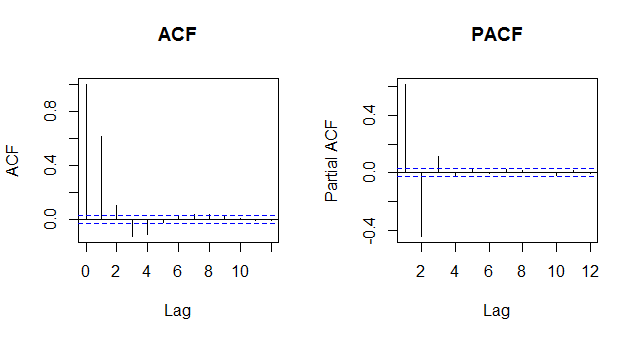
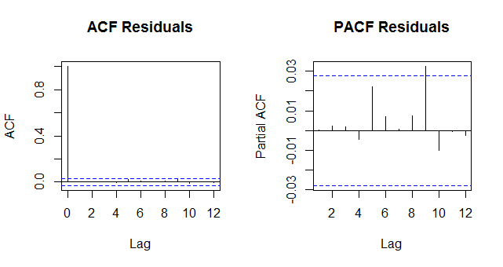
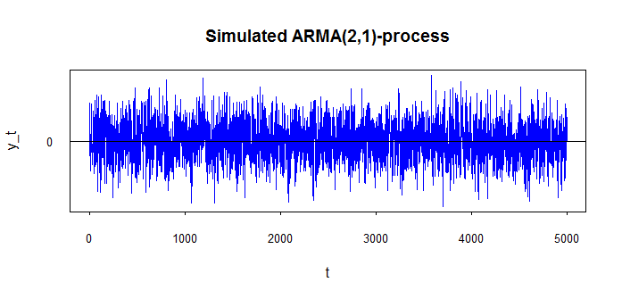

[](http://quantlet.de/index.php?p=info)

## [](http://quantlet.de/) **SFE_BoxJen** [](http://quantlet.de/d3/ia)

```yaml

Name of Quantlet : SFE_BoxJen

Published in : Statistics of Financial Markets II

Description : 'SFE_BoxJen code introduces the Box-Jenkins Method. First, it simulates an ARMA
process and tests it for a unit root with Dickey Fuller Test. Next, the ACF and PACF of the series
are visually inspected and a function for identifying the best ARMA model for a given time series
according to the AIC criterion is indroduced. Finally, the best model according to the above
function is being diagnosed.'

Keywords : Box Jenkins, time series, AR, MA, ARMA

Author : Sophie Stadlinger, Karolina Stanczak

Submitted : 2016/06/17

Output : 'Order of the best ARMA model according to the AIC criterion for a given time series. Time
series plot, ACF and PACF plots of a time series and its residuals.'

```








```r
# ------------------------------------------------------------------------------
# Published in: Statistics of Financial Markets II
# ------------------------------------------------------------------------------
# Description:  The following code introduces the Box-Jenkins Method. First, it
#               simulates an ARMA process and tests it for a unit root with  
#               Dickey Fuller Test. Next, the ACF and PACF of the series are   
#               visually inspected and a function for identifying the best  
#               ARMA model for a given time series according to the AIC   
#               criterion is indroduced. Finally, the best model according to 
#               the above function is being diagnosed.
# ------------------------------------------------------------------------------
# Keywords:     Box Jenkins, time series, AR, MA, ARMA
# ------------------------------------------------------------------------------
# Author:       Sophie Stadlinger, Karolina Stanczak
# ------------------------------------------------------------------------------
# Submitted:    2016/06/17
# ------------------------------------------------------------------------------
# Datafile:     -
# ------------------------------------------------------------------------------
# Input:        -
# ------------------------------------------------------------------------------
# Output:       Order of the best ARMA model according to the AIC criterion for
#               a given time series. Time series plot, ACF and PACF plots of a 
#               time series and its residuals.
# ------------------------------------------------------------------------------

#########################################################
##############      Preparations      ###################
#########################################################
##      - Installing & loading required packages
##      - Setting working directory


# Function for installing & loading required packages.
loadinstallpackages = function(packs){
  new.packs = packs[!(packs %in% installed.packages()[, "Package"])]
  if (length(new.packs)) 
    install.packages(new.packs, dependencies = TRUE)
  sapply(packs, require, character.only = TRUE)
}

# Packages we will need for our code are inside "packs"
packs = cbind("tseries", "quantmod", "scales","kedd")
loadinstallpackages(packs)

# Set working directory:
# setwd()

#########################################################
###############      Time Series      ###################
#########################################################

# Simulate ARMA Process
set.seed(231)
ts = arima.sim(n=5000, list(ar= c(0.68, -.32), ma= c(0.24)), 
               innov = rnorm(5000))

## Visualize the data
# Plot of the stochastic process
plot(ts, type = "l", lwd = 1, ylab = "y_t",col = "blue", 
     frame = T, axes = F, xlab = "t", 
     main = "Simulated ARMA(2,1)-process")
axis(side = 2, at = seq(0, 2250, by = 250), las=1, lwd = 1, tck = 1, 
     col = "black", cex.axis = 0.8)
axis(side = 1, lwd = 0.01, tck = -0.02, col = "black", cex.axis = 0.8)

#########################################################
############     Box-Jenkins-Method      ################
#########################################################

########################
# 1. Step
# Identification
########################

# Function that checks for stationarity (requires "tseries" package):
# Dickey Fuller Test
is.stationary = function(data,
                          alpha = 0.05
){
  options(warn=-1)
  outcome = adf.test(data)
  if (outcome$p.value < alpha){
    print(sprintf("%s is stationary", 
                  as.character(substitute(data))))        
  }
  else{
    print(sprintf("WARNING! %s is not stationary", 
                  as.character(substitute(data))))
  }
}

# Is stochastic process stationary?
is.stationary(ts) #TRUE

# Visual inspection of the ACF and PACF
par(mfrow = c(1,2))
acf.ts    = acf(ts,lag=12, main = "ACF")  
pacf.ts   = pacf(ts,lag=12, main = "PACF")


########################
# 2. Step
# Estimation
########################

#### The following function finds the best ARMA model based on the AIC 
#### The function contains the estimation stage and the diagnostic  
#### checking stage of the Box Jenkins Method

alpha     = 0.05
best_arma = function(data, orderp, orderq){
  # Set up some values that will help us write the code:
  options(warn=-1)
  rangep = 1:orderp
  rangeq = 0:orderq
  nr.of.models = (orderp) * (orderq+1)  
  
  # Create a container for the AIC of the models
  n        = 1           # n will help with the indexing
  aic      = matrix(rep(100000), ncol=nr.of.models, nrow=2)
  
  
  # Check different ARMA models
  for(i in rangep){
    for(j in rangeq){
      output = arima(data, order = c(i, 0, j))
      # For testing ARMA(p,q) residuals, fitdf should be set to p+q (see
      # Box.test-help). Lag has to be larger than fitdf, so lag = p+q+1 when
      # testing residuals.
      pvalue = Box.test(output$residuals, lag = i + j + 1, type = "Ljung", 
                        fitdf = i + j)$p.value
      aic[1, n] = paste("ARMA(", i, ",", j, ")", sep = "")
      
      if (pvalue >= alpha) {
        aic[2, n] = output$aic
      } else {
        print(sprintf
              ("WARNING! The ARMA(%d, %d) model contains correlated residuals", 
              i, j))
      }
      n = n + 1
    }
  }
  
  # Which model gives the lowest (= best) AIC?:
  min.aic = min(as.numeric(aic[2, ]))
  bestmodel = print(paste("The lowest AIC is provided by", 
                          aic[1, as.numeric(aic[2, ]) == min.aic]))
  index = as.numeric(unlist(strsplit
                            (aic[1, as.numeric(aic[2, ]) == min.aic], 
                                     "[^[:digit:]]")))
  index = index[!is.na(index)]
  p = index[1]
  q = index[2]
  
  # Calculating the best model
  bestmodeloutput = arima(data, order = c(p, 0, q))
  
  
  final = list(bestmodel = bestmodel, aic = aic, 
               bestmodeloutput = bestmodeloutput)
  return(final)
}

arma_best = best_arma(ts, 3, 3)

########################
# 3. Step
# Diagnostic
########################

par(mfrow = c(1,2))
# check if residuals are uncorrelated
bestACFres  = acf(arma_best$bestmodeloutput$residuals, lag = 12, 
                  main = "ACF Residuals")
bestPACFres = pacf(arma_best$bestmodeloutput$residuals, lag = 12, 
                   main = "PACF Residuals" )

```
